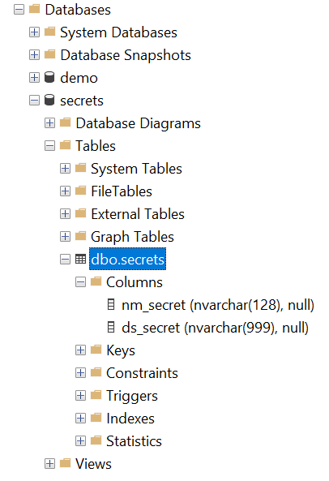

# 1. Implementing Secrets Database ([Back to Readme](../../../README.md#tutorials-secrets-database))

When Implementing a Data Platform, you will likely encounter all sorts of credentials infromation that is needed to access the desired datasets. To combine this with the idea to use as few technologies/tools as possible, we can us a SQL Database to stored the `secrets`. However, if you are building a large dataplatform and in the cloud, one to the native secret manager should be used. Deppening on the platform these are some options [Azure Key Vault](https://azure.microsoft.com/nl-nl/products/key-vault), [AWS Secrets Manager](https://aws.amazon.com/secrets-manager/), [Keeper](https://www.keepersecurity.com/) or [HashiCorp Vault](https://www.hashicorp.com/en/products/vault).

For now or `Demo` / `Tutorial` we use our simple `secrets`-database.

***Languages***


***Technologies***


***Tooling***


---

***Table of Content***

- [1. Implementing Secrets Database (Back to Readme)](#1-implementing-secrets-database-back-to-readme)
  - [Getting Started](#getting-started)
    - [Assumtions](#assumtions)
    - [Pre-requirements](#pre-requirements)
    - [Installation](#installation)
      - [PowerShell-script](#powershell-script)
      - [Validate in SSMS](#validate-in-ssms)
        - [image: *Validation check if `secrets`-database was deployed.*](#image-validation-check-if-secrets-database-was-deployed)
  - [Adding, Reading and Removing Secrets](#adding-reading-and-removing-secrets)
    - [Adding a Secret](#adding-a-secret)
      - [Example Script: Adding AccessKey for Azure Storage Account](#example-script-adding-accesskey-for-azure-storage-account)
    - [Reading a Secret](#reading-a-secret)
      - [Example Script: Reading AccessKey for Azure Storage Account](#example-script-reading-accesskey-for-azure-storage-account)
  - [Secret to the Azure Blob Storage (Static Web Server)](#secret-to-the-azure-blob-storage-static-web-server)
  - [All Done](#all-done)

---

## Getting Started

### Assumtions

1. You have used the ***powershell***-scripts to clone the templates
2. Copied to solution/projects/code to (your) `meta-data-model`
3. Copied to solution/projects/code to (your) `meta-data-defintions` your first `model`. 
4. Deployed both the `meta-data-model` and `meta-data-defintions`.
5. otherwise execute the 2 ***powershell***-scripts form the [README](../../../README.md)

### Pre-requirements

1. Access to SQL server to create a database with the SQL Authentication Access, If you have right to create a database, create a database named `secrets` (if you don\`t have the rights, have them created).
    1. add non-personal-account with rights to insert, update, select and delete records in from dbo.secrets.
    2. add non-personal-account with right to create tables in dbo-schema.

2. make sure you can execute python on you machine.
3. make sure you have access to the secrets database. (server, database, username and password)

### Installation

The `meta-data-model`-repository has a `visual studio`-solution with a `project` named `Secrets-Database` stored in the `..\meta-data-model\meta-data-model\0-secrets`-folder. This a relative simple project and contrains only 1 table named `Secrets` win the `dbo`-schema. To deploy this database the following script should be executed, otherwise you could start up `Visual Studio` and publish the project manually.

#### PowerShell-script

Steps:

1. Is too open the folder location to [1-Implementing-a-Secrets-Database.bat](1-Implementing-a-Secrets-Database/PowerShell-Script.bat) on **'your'-local** repository. 
2. Execute the `bat`-file by double clicking on it.

or Open a command prompt window and excute the command below, you must first copy the full path to the `bat`-file. 

````cmd
powershell -ExecutionPolicy Bypass -File "<copy-paste-the-full-path-to-this-script.ps1>"
````

The script will prompt the user for database access credentials.

#### Validate in SSMS

To validate if the `Secrets`-database has been deploy lets open SSMS (SQL Server Management Studio or some simular tooling). Connect to the databasek (using the same credentials or some personal account). You should seen something like the image below.



##### image: *Validation check if `secrets`-database was deployed.*

## Adding, Reading and Removing Secrets

Now that we have a `secrets`-database we would like to place some `secrets` in it. This can be done with the python code from the `meta-data-definitions`-repository, the code is also copied into `your`-model and could be found in the local path of `..\<the-name-of-your-model>\4-processing-python\modules\secrets.py`, in the markdown file `secrets.md` functional docuementation can be found. However for this tutorial the function `add_secret`, `read_secret` and `del_secret` are of relavants. The `read_secret` is used in de `data_pipeline`- and `export_documentation`-procedures.

### Adding a Secret

This function we will use to store the `AccessKey` for the `Azure Storage Account` where we will "host" our static web service to make documentation accessible.

#### [Example Script](1-Implementing-a-Secrets-Database/add-scret.py): Adding AccessKey for Azure Storage Account

````python
# Add the directory containing the file to sys.path
import getpass
import sys
fp_git_folder = input(f"Git-Folderpath  : ")
nm_your_repo  = input(f"Repository Name : ")
fp_modules    = f"{fp_git_folder}/{nm_your_repo}/4-processing-python/modules"
sys.path.insert(0, fp_modules) 

# Import the module
from secrets import add_secret, read_secret, get_current_file_folder

# Use the module
nm_secrets = "Your-Secret"
ds_secrets = getpass.getpass(f"Please enter your Secret: ") # enter secret
add_secret(nm_secrets, ds_secrets)
````

To validate the if the `Secret` was inserted into the SQL Server Database, please logon and execute the SQL statement below.

````SQL
SELECT * 
FROM dbo.secrets 
WHERE nm_secret = 'Your-Secret'
````

The result should be something like this.

| nm_secret |	ds_secret |
|---|---|
| Your-Secret | gAAAAABoe9p_0N7WnD7BH-8eIOxb8BlgmeggBaNZXn8Pf2VRBy949E5Lpq82Zru_UlpK65X0Kzg3Y7CzGH2qNMWVGhStelm34A== | 

> Note the `ds_secret`-value is hashed, and can be cracked with suffient processing power or the password stored in the encryption_key-file. The encryption_key is also hashed and only accessible bij de user how created the file. By removing the file the python secret-function will prompt the user to provide the password, so make it available for other users.

### Reading a Secret

Storing a secret somewhere is usefull, however there must be away te extract the secret again so it can be used to gain access to a resource. In the same python module `secrets` the function  `read_secret` performance this task. In the exampl code below .

#### [Example Script](1-Implementing-a-Secrets-Database/read-secret.py): Reading AccessKey for Azure Storage Account

````python
# Add the directory containing the file to sys.path
import getpass
import sys
fp_git_folder = input(f"Git-Folderpath  : ")
nm_your_repo  = input(f"Repository Name : ")
fp_modules    = f"{fp_git_folder}/{nm_your_repo}/4-processing-python/modules"
sys.path.insert(0, fp_modules) 

# Import the module
from secrets import add_secret, read_secret, get_current_file_folder

# Validate add `Accesskey`
nm_secrets = "Your-Secret"
tx_secrets_extract = read_secret(nm_secrets)
ds_secrets = getpass.getpass(f"Please enter your Secret: ")
if (tx_secrets_extract == ds_secrets):
    print(f"Stored Accesskey is Valid!")
else:
    print(f"Stored Accesskey is Invalid!")  
````

## Secret to the Azure Blob Storage (Static Web Server)

The following assumes your have already configured Azure Storage Account with `$web`-containter the in configuared as a `static web server`. The already avialable python code in the data-pipeline procedure will also update the `documentation` by uploading a html-page to this `static web server`. What we\`ll need is the `Account`, `AccessKey` and `Container`. In the `export_documentation`-procedure the secrets are retrived form the secrets database with the following `Secret`-names:

- my-abs-documentation-account
- my-abs-documentation-accesskey
- my-abs-documentation-container

with the `python`-code below we can set the `secrets`:

````python
# Add the directory containing the file to sys.path
import getpass
import sys
fp_git_folder = input(f"Git-Folderpath  : ")
nm_your_repo  = input(f"Repository Name : ")
fp_modules    = f"{fp_git_folder}/{nm_your_repo}/4-processing-python/modules"
sys.path.insert(0, fp_modules) 

# Import the module
from secrets import add_secret, read_secret, get_current_file_folder

# Retrive the information by prompting the user
nm_account   = input(f"Account   : ")
nm_container = input(f"Container : ")
ds_secrets   = getpass.getpass(f"Secret    : ") # enter secret

# Setting my-documentation-... secrets.
add_secret("my-abs-documentation-account",   nm_account)
add_secret("my-abs-documentation-accesskey", nm_container)
add_secret("my-abs-documentation-container", ds_secrets)
````

## All Done

You now have `Secrets`-database and python scripts/functions to add and read secrets to/form the database, which can be used in data-pipelines.
