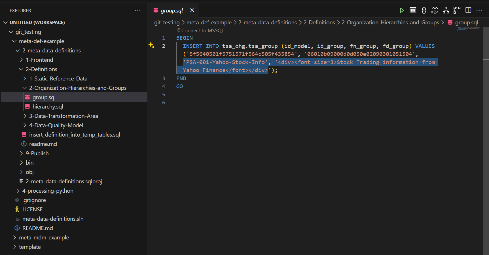
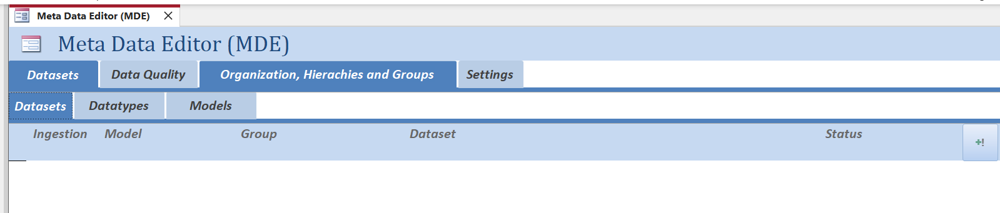
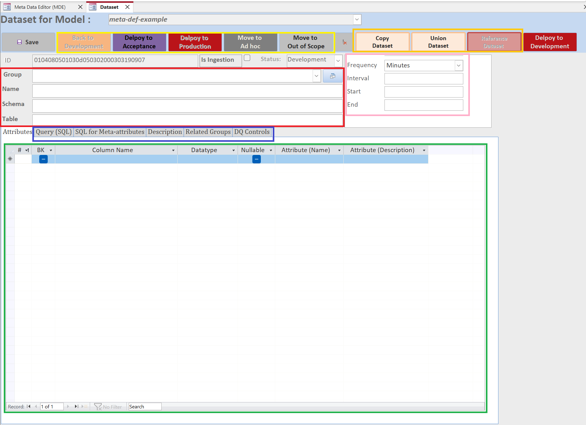
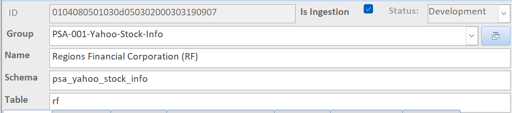
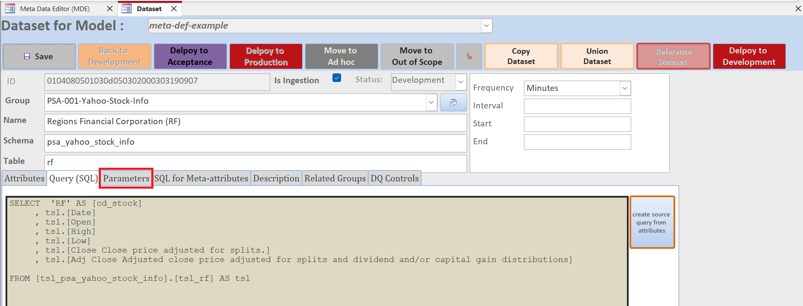
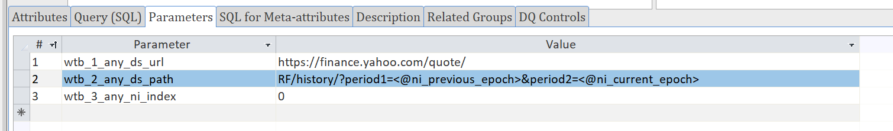
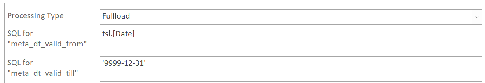

Back to [Readme](../../../README.md#tutorials-ingestions)

<h4>Languages:</h4>


<h4>Technologies:</h4>


<h4>Tooling:</h4>


# Ingestion of ***Stock Trade Infromation*** (webtable from Yahoo)

This tutorial will help you design an `ingestion`-dataset which will incrementally load `stock tradaing information` from the [Yahoo Finance](https://finance.yahoo.com/quote/RF/history)-website for a specific `share` of `Regions Financial Corporation (RF)`.

---

## **User Story:**

As an **analyst**,  
I want to access **historical stock trading data** for **Regions Financial Corporation (RF)**,  
So that I can **analyze the share’s behavior** and **calculate trading performance metrics** such as **losses, gains, and yield (rendement)**.

Additionals Infomation:
Loading trade information for the last 5 year should give a good inpression of what is happing with the share. 
next to **Regions Financial Corporation (RF)**, also make ***Koninklijke KPN N.V. (KPN.AS)*** aviablable.

---

## Implement this Userstory

1. [Investication of structure of the dataset](#investication-of-structure-of-the-dataset-back-to-top)
2. [Determine if Incremental loading is possible](#determine-if-incremental-loading-is-possible-back-to-top)
3. [Design dataset in `meta-data-editor`](#design-dataset-in-meta-data-editor-back-to-top)
4. [Deployment of Model](#deployment-of-model-back-to-top)
   - With Visual Studio
   - With button in Tool
   - powershell script (Tooling maybe block by virus/malware protection programs)
4. Test Run and Validate Results
   - First Test Run
   - Manipilate the "Target" to simulate "Incremental" loading.

## Investication of structure of the dataset ([back to top](#implement-this-userstory))

What you see, is not always what you get. The python data pipeline is basically a web-scrapper and de `table` we want to extract may presentated differently on the webpage and is in html. So the first step is to fetch the file manually. We can do this by reusing the existing python code.

### goto website
The historical tade information can be found on the website of [yahoo](https://finance.yahoo.com/) here we can search for the desitred share.

our first result is "https://finance.yahoo.com/quote/RF/", however these are not historcal data. Exploring the website further, we`ll find link/button "Historical Data". By clicking this the website load a table with trade infromation on a daily basis for the past year. More exploration of the website reviels that specific periodes can be selected. Let doe only the last 5 Days.

the url is now : "https://finance.yahoo.com/quote/RF/history/?period1=1752577325&period2=1753008901"

Let desect the URL
- https://finance.yahoo.com/quote/ (this seems fixed)
- RF/ (This correlates with the Stock/Share we have requested information on)
- history/ (seems to indicate the retrieved info is historical)
- ?period1=1752577325&period2=1753008901 (This show there are 2 periods-parameters both followed by number, deeper investication learns the these numbers are in the epoch-format and thus represent 2 point in time)

### Mapping 

The python procedure that extract the web-table is found `<your-git-folder>\<name-of-your-model>\4-processing-python\modules\`-folder and the `source.py`-file. The procedure is named `web_table_anonymous_web` and hase 4 input parameters.

- wtb_1_any_ds_url  (Base URL, the part that does not change)
- wtb_2_any_ds_path (Path, then dynamic part of URL that detemines the filtering of what information is loaded onto the webpage.)
- wtb_3_any_ni_index (Index of the Tables on the webpage)
- is_debugging (if set to true more detailed information is printed to consul window)

### Lets doe the mapping:

python: ***[example](1-Stock-Trade-Information.py) script to get same*** 

````python

# Add the directory containing the file to sys.path
import sys
#fp_git_folder = input(f"Git-Folderpath  : ")
#nm_your_repo  = input(f"Repository Name : ")
# if you don't want type in the folder/file path on runtime.
#fp_git_folder = "path-to-your-git-folder"
#nm_your_repo  = "name-of-your-repository"

# Set the path to the modules directory
fp_modules    = f"{fp_git_folder}/{nm_your_repo}/4-processing-python"
sys.path.insert(0, fp_modules) 

# Import Modules
from modules import source as src  # type: ignore

# Extract web table
df = src.web_table_anonymous_web (
    wtb_1_any_ds_url   = "https://finance.yahoo.com/quote/",
    wtb_2_any_ds_path  = "RF/history/?period1=1752577325&period2=1753008901",
    wtb_3_any_ni_index = "0",
    is_debugging       = "1"
)

print(df.columns)

````

The result:
````
Index(['Date', 'Open', 'High', 'Low', 'Close Close price adjusted for splits.',
       'Adj Close Adjusted close price adjusted for splits and dividend and/or capital gain distributions.',
       'Volume'],
      dtype='object')
````

We now have identified all the `return` columns from the dataset.

##### table 1: Columns

| Column |
|:--- | 
| Date | 
| Open | 
| High | 
| Low | 
| Close Close price adjusted for splits. | 
| Adj Close Adjusted close price adjusted for splits and dividend and/or capital gain distributions |


## Determine if Incremental loading is possible ([back to top](#implement-this-userstory))

Loading incrementally is great for NOT loading the same data over and over gain, it give control over what is loaden and what is left out. Let continue exaiming the URL information. As we heve learn there were two periodes in the URL, both followed by number. investicator learn that these are enpoch-formatted datatimes. This give us the means to control was `period` is loaded. The user/developer has the abbility to use `placeholders`, more info on this you can find [here](additional/placeholder.md).

In this case we will need the epoch-placeholder `ni_previous_epoch` and ` ni_current_epoch`. by replacing the number in URL we can make the data-pipeline run incremental.

The `parameter` named `wtb_2_any_ds_path` must be populated with the value
````python
"RF/history/?period1=<@ni_previous_epoch>&period2=<@ni_current_epoch>"
````

## Design dataset in `meta-data-editor` ([back to top](#implement-this-userstory))

If the `meta-data-editor` access application is not open yet start it by finding `Start-Meta-Data-Editor.bat` for the `Model` you want to add the Dataset. If found execute the bat-file.

### Adding first a ***Group***

If you have only a few dataset in your model, maintaining overview is easy, however as you will learn/known it is seldon a few. So let create a Group for the 2 dataset with "***Stock Trading Infromation***". Let name it "PSA-001-Yahoo-Stock-Info" with a description of "Stock Trading information from Yahoo Finance".

Navigate to the List of Groups, see image below, clicking the "Organization, Hierarchy and Group"-tab, then click the sub tab "Groups".


#### Let validate the metadata was updated:

Open Visual Studio Code, if it was not already open, find your repository (model), since this is the first "Group" the sql-file should look something like this



### Adding first ***Ingestion***-dataset

To design a new dataset you must click on the "*Dataset*"-tab and then select the sub tab "*Dataset*", see screen shot below.



To add new "***Dataset***" click on the new-dataset-buttn, see image below with add-button highlighted in red.


#### Dataset (general info)

The tool will open een detail form for "Dataset", the image below wil hight various part of the form which will be explain, per highlighted part. 



| Highlighted | Description |
|:---         |:---         |
| Red         | General Dataset information, like **Group**, **Functionalname**, **Schema** anb **Table**. |
| Green       | List form for the **Attributes** of the dataset, like **Ordering**, **Columnname**, **Datatype**, **Nullable**, **Functionalname** and **Description**. |
| Pink        | Scheduling Infromation (metadata aviable, but not yet implementate in seleectin what datasets need refreshing, or data-pipeline need to be run). | 
| Yellow      | Development Status, these buttons control the development status of the **Dataset**, this is usefull when running in production and you get updated requirements. | 
| Orange      | Action button for **Copying** or **Unioning** datasets. |
| Blue        | Tabs to related meta-data infromation for the Dataset. |

### General Information

Let add the general infromation about this dataset. The first we thing we must set correct is the "*check-box* named "*Is Ingestion*", this must be set to `true`. Now we can start setting the general information.
- Set the `Group` to the "PSA-001-Yahoo-Stock-Info", created in the previous step, see [above](#adding-first-a-group).
- Set the `Name` (of the dataset) to the name of the share we want te load historical information from, thus "*Regions Financial Corporation (RF)*".
- For `Schema` a good name must be set, the naming convention enforce by "checks" during deployment, state it should be all lower case with underscore to separated words. the `Schema` will also automically given a prefix of "psa_". Example for a name could be : "psa_yahoo_stock_info" reflecting the name of the group. In the schema in the database the table will be created.
- Set then `Table` to "***rf***" for the code of the share.

This would look soimething like the image below.



> **Note:** PSA stand for **P**resistent **S**taging **A**rea.

> We can NOT yet "***Save***" the information, we`ll still need to provide the "***Attributes*** and "***Source Query***".

On the "***Description***"-tab (highlighted in blue before) a functional description of the dataset can be provided, we\`ll leave it empty for now. However the business should provide this, remember `Engineeging` is mearly to party that builds the `datapaltform`.

### Attributes

In our exploration with python of the dataset the **Columns** were determined, see [list of columns](#table-1-columns). Ingestion of Dataset where alle columns are set to ***Datatype*** NVARCHAR(999) are less likely to fail on some datatype conversion, thus we will set everthing to NVARCHAR(999). Of course if the datatypes are known then setting them is better. However here the dataset is a webtable the NVARCHAR(999) option is best.

> **Tip**: open empty excel-sheet and enter the list there first copy-and-past all the repeating stuff, then when you done copy the whole list and past it into the list-form for the **Attributes**.

After adding the Attribute information, the result must look something like the image below.

### Source Query

After adding the Column information, the "***Source Query***-tab can be open, on the right-side of the form next to text-field, there is a button with the text "*create source query from attributes*", by clicking this button the " ***source query*** is automatically write for you. 

The "***Source Query***" will look like something of the SQL below.

````SQL
SELECT tsl.[Date]
     , tsl.[Open]
     , tsl.[High]
     , tsl.[Low]
     , tsl.[Close Close price adjusted for splits.]
     , tsl.[Adj Close Adjusted close price adjusted for splits and dividend and/or capital gain distributions]

FROM [tsl_psa_yahoo_stock_info].[tsl_rf] AS tsl
````

You likely note that the schema and table names are not the same as in the general information, this is because the data from the webtable will first land in the tsl_rf on the schema tsl_psa_yahoo_stock_info and after processing (running the data-pipeline) in the database the ***psa_yahoo_stock_info.rf*** should be updated.

> **Note:** TSL stand for **T**emporal **S**taging **L**anding.

Now we have ***General Information***, ***Attributes*** and ***Source Query***, we can now click on the "***Save***"-button, the tool will update the SQL-files in the repository with the new information.

> ***Note***: the **ID** is generated and likely NOT the same in our example!

In the `..\meta-def-example\2-meta-data-definitions\2-Definitions\3-Data-Transformation-Area`-folder the `dataset.sql` should be updated with the newly created "***dataset***"-file (`0104080501030d050302000303190907.sql` from our example).

````SQL
/* -------------------------------------------------------------------------- */
/* Definitions for `Dataset` and `related`-objects like `attributes`,         */
/* `DQ Controls`, `DQ Thresholds` and `related Group(s)`.                     */
/* -------------------------------------------------------------------------- */
/*                                                                            */
/* ID Dataset : `0104080501030d050302000303190907`                            */
/*                                                                            */
/* -------------------------------------------------------------------------- */
BEGIN

  /* --------------------- */
  /* `Dataset`-definitions */
  /* --------------------- */
  INSERT INTO tsa_dta.tsa_dataset (id_model, id_dataset, id_development_status, id_group, is_ingestion, fn_dataset, fd_dataset, nm_target_schema, nm_target_table, tx_source_query) VALUES ('5f5640501f5751571f564c505f435854', '0104080501030d050302000303190907', '06010b0900010908010d0e0404021503', '06010b09000d0d050e02090301051504', '1', 'Regions Financial Corporation (RF)', NULL, 'psa_yahoo_stock_info', 'rf', 'SELECT  ''RF'' AS [cd_stock]<newline>     , tsl.[Date]<newline>     , tsl.[Open]<newline>     , tsl.[High]<newline>     , tsl.[Low]<newline>     , tsl.[Close Close price adjusted for splits.]<newline>     , tsl.[Adj Close Adjusted close price adjusted for splits and dividend and/or capital gain distributions]<newline><newline>FROM [tsl_psa_yahoo_stock_info].[tsl_rf] AS tsl');
  
  /* ----------------------- */
  /* `Attribute`-definitions */
  /* ----------------------- */
  INSERT INTO tsa_dta.tsa_attribute (id_model, id_attribute, id_dataset, id_datatype, fn_attribute, fd_attribute, ni_ordering, nm_target_column, is_businesskey, is_nullable) VALUES ('5f5640501f5751571f564c505f435854', '0104080501030d050205010900190009', '0104080501030d050302000303190907', '000e0b00050008010800000102140a0c', 'Code', 'Code Stock/Share', '0', 'cd_stock', '1', '1');
  INSERT INTO tsa_dta.tsa_attribute (id_model, id_attribute, id_dataset, id_datatype, fn_attribute, fd_attribute, ni_ordering, nm_target_column, is_businesskey, is_nullable) VALUES ('5f5640501f5751571f564c505f435854', '06020d070f030f030701010801041507', '0104080501030d050302000303190907', '000b0f06090d0904090d000c05091400', 'Trading Date', 'Trading Date', '1', 'Date', '1', '1');
  INSERT INTO tsa_dta.tsa_attribute (id_model, id_attribute, id_dataset, id_datatype, fn_attribute, fd_attribute, ni_ordering, nm_target_column, is_businesskey, is_nullable) VALUES ('5f5640501f5751571f564c505f435854', '06050f030f0c0f02070d000302001503', '0104080501030d050302000303190907', '000b0f06090d0904090d000c05091400', 'Open', 'Open', '2', 'Open', '1', '1');
  INSERT INTO tsa_dta.tsa_attribute (id_model, id_attribute, id_dataset, id_datatype, fn_attribute, fd_attribute, ni_ordering, nm_target_column, is_businesskey, is_nullable) VALUES ('5f5640501f5751571f564c505f435854', '02060d000e0c0f000e0d08010e190801', '0104080501030d050302000303190907', '000b0f06090d0904090d000c05091400', 'High', 'High', '3', 'High', '0', '1');
  INSERT INTO tsa_dta.tsa_attribute (id_model, id_attribute, id_dataset, id_datatype, fn_attribute, fd_attribute, ni_ordering, nm_target_column, is_businesskey, is_nullable) VALUES ('5f5640501f5751571f564c505f435854', '06010906010001080303000506031501', '0104080501030d050302000303190907', '000b0f06090d0904090d000c05091400', 'Low', 'Low', '4', 'Low', '0', '1');
  INSERT INTO tsa_dta.tsa_attribute (id_model, id_attribute, id_dataset, id_datatype, fn_attribute, fd_attribute, ni_ordering, nm_target_column, is_businesskey, is_nullable) VALUES ('5f5640501f5751571f564c505f435854', '06040f05000d010706020d020e031505', '0104080501030d050302000303190907', '000b0f06090d0904090d000c05091400', 'Close', 'Close Close price adjusted for splits.', '5', 'Close Close price adjusted for splits.', '0', '1');
  INSERT INTO tsa_dta.tsa_attribute (id_model, id_attribute, id_dataset, id_datatype, fn_attribute, fd_attribute, ni_ordering, nm_target_column, is_businesskey, is_nullable) VALUES ('5f5640501f5751571f564c505f435854', '010500050f0300020004000206190c02', '0104080501030d050302000303190907', '000b0f06090d0904090d000c05091400', 'Adj. Close', 'Adj Close Adjusted close price adjusted for splits and dividend and/or capital gain distributions', '6', 'Adj Close Adjusted close price adjusted for splits and dividend and/or capital gain distributions', '0', '1');

  /* ------------------------------ */
  /* `Parameter Values`-definitions */
  /* ------------------------------ */
  -- No Defintions for `Parameter Values`

  /* ------------------------------ */
  /* `SQL for ETL`-definitions      */
  /* ------------------------------ */
  -- No Defintions for `SQL for ETL`

  /* ------------------------------ */
  /* `Schedule`-definitions         */
  /* ------------------------------ */
  -- No Defintions for `SQL for ETL`

  /* -------------------------------- */
  /* `Related (Group(s))`-definitions */
  /* -------------------------------- */
  -- No Defintions for `Related (Group(s))`

  /* ------------------------ */
  /* `DQ Control`-definitions */
  /* ------------------------ */
  -- No Defintions for `DQ Control`

  /* -------------------------- */
  /* `DQ Threshold`-definitions */
  /* -------------------------- */
  -- No Defintions for `DQ Threshold`
  
END
GO
````

### Parameters

Since this is a "***Ingestion***"-dataset the data-pipeline in pythonb must recieve information where to extract the data. This information/metadata is provided in the "***parameter***"-tab.



by clicking op this tab the list of paramaters is shown, we must now enter the same parameter that we used before in our exploration. we'll should use the incremental parameters settings. This would result in something like below.



the sql-file for the dataset should be update as wel with the paramater information and the `parameter`-section would look like the sql below.

````SQL

  /* ------------------------------ */
  /* `Parameter Values`-definitions */
  /* ------------------------------ */
  INSERT INTO tsa_dta.tsa_parameter_value (id_model, id_parameter_value, id_dataset, id_parameter, tx_parameter_value, ni_parameter_value) VALUES ('5f5640501f5751571f564c505f435854', '06010b09000d0d050e0d0d0203031506', '0104080501030d050302000303190907', '00040c060f030a040007090507190d05', '0', '3');
  INSERT INTO tsa_dta.tsa_parameter_value (id_model, id_parameter_value, id_dataset, id_parameter, tx_parameter_value, ni_parameter_value) VALUES ('5f5640501f5751571f564c505f435854', '0e01000002040d0401000c0703190e08', '0104080501030d050302000303190907', '030001030306000407070b001b020001', 'https://finance.yahoo.com/quote/', '1');
  INSERT INTO tsa_dta.tsa_parameter_value (id_model, id_parameter_value, id_dataset, id_parameter, tx_parameter_value, ni_parameter_value) VALUES ('5f5640501f5751571f564c505f435854', '02020f010e06090803020b0504190e04', '0104080501030d050302000303190907', '06060e030f000b0104070b080f0c1503', 'RF/history/?period1=<@ni_previous_epoch>&period2=<@ni_current_epoch>', '2');

````

### SQL for Meta-Attributes

With the "***parameters***" we are almost complete, the framework/data processing need to known how to handle the increment of the dataset. It need to known which attributes will determine if a records is still valid. This informations is provided on the "***SQL for Meta-Attributes***"-tab. There are three field ***Processing Type***, ***SQL for "meta_dt_valid_from"*** and ***SQL for "meta_dt_valid_till"***. In our example we should set these values as follows.

| Field | Value | Description |
|:---   |:---   |:---         |
| Processing Type | Incremental | This dataset set can be loaded incrementally, otherwise the framework will expect the full dataset evertime. |
| SQL for "meta_dt_valid_from" | tsl.[Date] | The "*Date*"-attribute holds the value for the trading day, in combination with the other businesskeys will make/should be unique. |
| SQL for "meta_dt_valid_till" | '9999-12-31' | The data in this dataset is sort of transactional and thus there is not real `end` date. |

the result would look something like the image below.



### Other tabs

The other tabs ***Related Groups*** and ***DQ Controls** can by ignored for now.

## Deployment of Model ([back to top](#implement-this-userstory))

There are basically 3 way to deploy your changes in your model to the database.

- Old school `Visual Studio`, the underlay project and solutions are a `Visual Studio Solution`.
- Running a `powershell` script that automated all the manual steps you would do in `Visual Studio`. 
- Via the `meta-data-editor`, the button on the detail-form of `dataset` basically start option 2.

### 1. Old school `Visual Studio`

The following step should be taken:

1. Find the `solution`-file of your model, the relative path should be sopmething like `<path-to-your-repository-folder>\<name-of-model>\meta-data-definitions.sln`, start the `solution`. Ones opened you\`ll notice it pritty empty, that because all of the deployment logic is in the `meta-data-model`.
2. Open the properties of the Project and ensure the database version is correct.
3. Right-click the project and build the project.
4. Right-click the project and Publish the project
   1. Setup the Database connect
   2. save to profile for later reusability
   3. Publish.

### 2. Powershell

with *powershell* all of these steps can be automated, thes script `deployment-of-model.ps1` can be found in the `<path-to-your-repository-folder>\<name-of-model>\2-meta-data-definitions\9-Publish\1-Scripts`, some documentation about the script can be found in de `deployment-of-model.md`-file.

The script will prompt the user for database credentials, which will be stored locally in a secure manner.

### 3. Via the `meta-data-editor`

On the "***detail***"-form for `dataset` on the right-side of the button-bar, an button with the text "*Deloy to Development*". By clicking on this butten the *pwershell*-script from point 2 will be executed on de background, the tooling will show waiting window.

> Important: the local virus/malware scanner may dislike this action, so you must make a exception for this.


