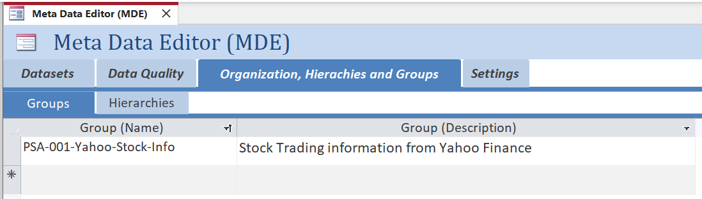
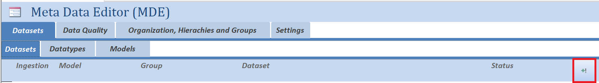
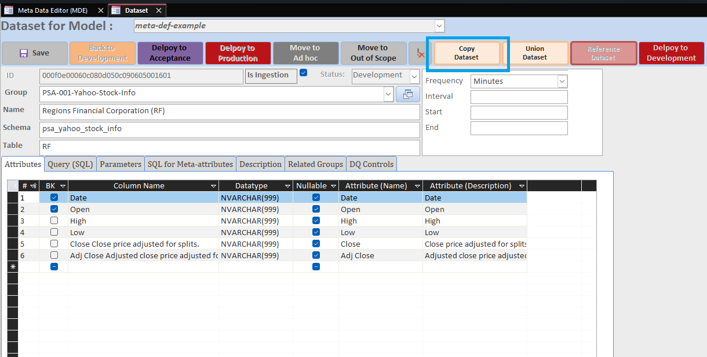

# Ingestion of ***Stock Trade Infromation*** (webtable from Yahoo) [Back to readme](../../../README.md#tutorials-ingestions)

This tutorial will help you design an `ingestion`-dataset which will incrementally load `stock tradaing information` from the [Yahoo Finance](https://finance.yahoo.com/quote/RF/history)-website for a specific `share` of `Regions Financial Corporation (RF)`. We\`ll be making use of the following languages, Technologies adn Tooling.

**Languages:**


**Technologies:**


**Tooling:**


***Table of Content***

- [Ingestion of ***Stock Trade Infromation*** (webtable from Yahoo) Back to readme](#ingestion-of-stock-trade-infromation-webtable-from-yahoo-back-to-readme)
  - [User Story](#user-story)
    - [Additionals Infomation](#additionals-infomation)
  - [Exploration of the dataset structure (back to top)](#exploration-of-the-dataset-structure-back-to-top)
    - [goto website](#goto-website)
    - [Mapping](#mapping)
    - [Lets do the mapping](#lets-do-the-mapping)
      - [table 1: Columns](#table-1-columns)
  - [Determine if Incremental loading is possible (back to top)](#determine-if-incremental-loading-is-possible-back-to-top)
  - [Design dataset in `meta-data-editor` (back to top)](#design-dataset-in-meta-data-editor-back-to-top)
    - [Adding first a ***Group***](#adding-first-a-group)
      - [Lets validate the metadata was updated](#lets-validate-the-metadata-was-updated)
    - [Adding first ***Ingestion***-dataset](#adding-first-ingestion-dataset)
      - [Dataset (general info)](#dataset-general-info)
    - [General Information](#general-information)
    - [Attributes](#attributes)
    - [Source Query](#source-query)
    - [Parameters](#parameters)
    - [SQL for Meta-Attributes](#sql-for-meta-attributes)
    - [Other tabs](#other-tabs)
  - [Deployment of Model (back to top)](#deployment-of-model-back-to-top)
    - [1. Old school `Visual Studio`](#1-old-school-visual-studio)
    - [2. Powershell](#2-powershell)
    - [3. Via the `meta-data-editor`](#3-via-the-meta-data-editor)
  - [Test Run and Validate Results (back to top)](#test-run-and-validate-results-back-to-top)
    - [python: ***example Test and Validata***](#python-example-test-and-validata)
    - [All Done for 'Regions Financial Corporation (RF)' Back to readme](#all-done-for-regions-financial-corporation-rf-back-to-readme)
  - [Implementing the ingestion of 'Koninklijke KPN N.V. (KPN.AS)' Back to readme](#implementing-the-ingestion-of-koninklijke-kpn-nv-kpnas-back-to-readme)
    - [Copy and Paste](#copy-and-paste)
  - [All Done](#all-done)

---

## User Story

As an **analyst**, I want to access **historical stock trading data** for **Regions Financial Corporation (RF)**, So that I can **analyze the share’s behavior** and **calculate trading performance metrics** such as **losses, gains, and yield (rendement)**.

### Additionals Infomation

Loading trade data for the last 5 year should give a good impression of what is happing with the share. Next to **Regions Financial Corporation (RF)**, also make ***Koninklijke KPN N.V. (KPN.AS)*** aviablable.

## Exploration of the dataset structure ([back to top](#ingestion-of-stock-trade-infromation-webtable-from-yahoo-back-to-readme))

Before we start designing the dataset, we must understand what the structure of the dataset is. For this purpose we\`ll be reusing various existing python procedures.

With webpages, what you see, is not always what you get. The python data pipeline is basically a web-scrapper and the `table` we want to extract maybe presentated differently on the webpage and is in html. So the first step is to fetch the dataset manually.

### goto website

The historical trade information can be found on the website of [yahoo](https://finance.yahoo.com/) here we can search for the desired information.

Our first result is `https://finance.yahoo.com/quote/RF/`, however these are not historcal data. Exploring the website further, we`ll find link/button "Historical Data". By clicking this the website load a table with trade infromation on a daily basis for the past year. More exploration of the website reviels that specific periodes can be selected. Let do only the last 5 Days.

The url is now : `https://finance.yahoo.com/quote/RF/history/?period1=1752577325&period2=1753008901`

Let desect the URL

- `https://finance.yahoo.com/quote/` (this seems fixed)
- RF/ (This correlates with the Stock/Share we have requested information on)
- history/ (seems to indicate the retrieved info is historical)
- ?period1=1752577325&period2=1753008901 (This show there are 2 periods-parameters both followed by number, deeper investication learns the these numbers are in the epoch-format and thus represent 2 point in time)

### Mapping

The python procedure that extract the web-table is found `<your-git-folder>\<name-of-your-model>\4-processing-python\modules\`-folder and the `source.py`-file. The procedure is named `web_table_anonymous_web` and hase 4 input parameters.

- wtb_1_any_ds_url  (Base URL, the part that does not change)
- wtb_2_any_ds_path (Path, then dynamic part of URL that detemines the filtering of what information is loaded onto the webpage.)
- wtb_3_any_ni_index (Index of the Tables on the webpage)
- is_debugging (if set to true more detailed information is printed to consul window)

### Lets do the mapping

python: ***[example](1-Stock-Trade-Information/1-Explore-Webtable.py) Explore Webtable***

````python

# Add the directory containing the file to sys.path
import sys
fp_git_folder = input(f"Git-Folderpath  : ")
nm_your_repo  = input(f"Repository Name : ")
# if you don't want type in the folder/file path on runtime.
#fp_git_folder = "path-to-your-git-folder"
#nm_your_repo  = "name-of-your-repository"

# Set the path to the modules directory
fp_modules    = f"{fp_git_folder}/{nm_your_repo}/4-processing-python"
sys.path.insert(0, fp_modules) 

# Import Modules
from modules import source as src  # type: ignore

# Extract web table
df = src.web_table_anonymous_web (
    wtb_1_any_ds_url   = "https://finance.yahoo.com/quote/",
    wtb_2_any_ds_path  = "RF/history/?period1=1752577325&period2=1753008901",
    wtb_3_any_ni_index = "0",
    is_debugging       = "1"
)

print(df.columns)

````

The result:

````text
Index(['Date', 'Open', 'High', 'Low', 'Close Close price adjusted for splits.',
       'Adj Close Adjusted close price adjusted for splits and dividend and/or capital gain distributions.',
       'Volume'],
      dtype='object')
````

We now have identified all the `return` columns from the dataset.

#### table 1: Columns

| Column |
|:--- |
| Date |
| Open |
| High |
| Low |
| Close Close price adjusted for splits. |
| Adj Close Adjusted close price adjusted for splits and dividend and/or capital gain distributions. |

## Determine if Incremental loading is possible ([back to top](#ingestion-of-stock-trade-infromation-webtable-from-yahoo-back-to-readme))

Incremental loading is advantageous as it prevents the repeated loading of the same data, providing control over what is loaded and what is omitted. Let us continue to examine the URL information. As we have learned, there are two periods in the URL, each followed by a number.

Investigation will learn that these represent epoch-formatted datetimes. This enables us to control which `period` is loaded.

Users and developers have the capability to utilize `placeholders`; further information on this topic can be found in [the placeholders documentation](.additional/placeholder.md).

In this case we will need the epoch-placeholder `ni_previous_epoch` and `ni_current_epoch`. by replacing the number in URL we can make the data-pipeline run incremental.

The `parameter` named `wtb_2_any_ds_path` must be populated with the value `RF/history/?period1=<@ni_previous_epoch>&period2=<@ni_current_epoch>`

## Design dataset in `meta-data-editor` ([back to top](#ingestion-of-stock-trade-infromation-webtable-from-yahoo-back-to-readme))

If the `meta-data-editor` access application is not open yet start it by finding `Start-Meta-Data-Editor.bat` for the `Model` you want to add the Dataset too, when found execute the bat-file to start the `meta-data=editor`.

### Adding first a ***Group***

When you have only a small number of datasets in your model, keeping track of everything is straightforward. However, as you may know, it is rarely just a few. Therefore, let's create a group for the two datasets. We will name it "PSA-001-Yahoo-Stock-Info" and describe it as "Stock Trading information from Yahoo Finance".

To find the List of Groups, refer to the image below, click on the "Organization, Hierarchy and Group" tab, and then select the sub-tab "Groups".



#### Lets validate the metadata was updated

Open Visual Studio Code, if it was not already open, find your repository (model), the `SQL`-file can be found `your_git_folder\your_model_name\2-meta-data-definitions\2-Definitions\2-Organization-Hierarchies-and-Groups\group.sql`. Since this is the first "Group" the sql-file should look something like this


### Adding first ***Ingestion***-dataset

To design a new dataset we must return to the `meta-data-editor`, here click on the "*Dataset*"-tab and then select the sub tab "*Dataset*", see screen shot below.


To add new "***Dataset***" click on the new-dataset-buttn, see image below with add-button highlighted in red.



#### Dataset (general info)

The tool will open een detail form for "Dataset", the image below wil hight various part of the form which will be explain, per highlighted part.


| Highlighted | Description |
|:---         |:---         |
| Red         | General Dataset information, like **Group**, **Functionalname**, **Schema** anb **Table**. |
| Green       | List form for the **Attributes** of the dataset, like **Ordering**, **Columnname**, **Datatype**, **Nullable**, **Functionalname** and **Description**. |
| Pink        | Scheduling Infromation (metadata aviable, but not yet implementate in seleectin what datasets need refreshing, or data-pipeline need to be run). |
| Yellow      | Development Status, these buttons control the development status of the **Dataset**, this is usefull when running in production and you get updated requirements. |
| Orange      | Action button for **Copying** or **Unioning** datasets. |
| Blue        | Tabs to related meta-data infromation for the Dataset. |

### General Information

Let's include the general information regarding this dataset. The first thing we need to ensure is that the "*check-box*" labelled "*Is Ingestion*" is set to `true`. After that, we can proceed to configure the general information.

- Assign the `Group` to "PSA-001-Yahoo-Stock-Info", which was created in the previous step, refer to [above](#adding-first-a-group).
- Set the `Name` (of the dataset) to the name of the share from which we want to load historical information, specifically "*Regions Financial Corporation (RF)*".
- For the `Schema`, a suitable name should be chosen, adhering to the naming convention enforced by "checks" during deployment, which requires it to be all lower case with underscores separating words. The `Schema` will also automatically receive a prefix of "psa_". An example of a name could be: "psa_yahoo_stock_info", which reflects the name of the group. The table will be created in the schema within the database.
- Finally, set the `Table` to "***rf***" for the share's code.

This would look soimething like the image below.


> **Note:** PSA stand for **P**resistent **S**taging **A**rea.
> We can NOT yet "***Save***" the information, we`ll still need to provide the "***Attributes*** and "***Source Query***".

On the "***Description***"-tab (highlighted in blue before) a functional description of the dataset can be provided, we\`ll leave it empty for now. However the business should provide this, remember `Engineeging` is mearly to party that builds the `datapaltform`.

### Attributes

In our exploration with python of the dataset the **Columns** were determined, see [list of columns](#table-1-columns). Ingestion of Dataset where alle columns are set to ***Datatype*** NVARCHAR(999) are less likely to fail on some datatype conversion, thus we will set everthing to NVARCHAR(999). Of course if the datatypes are known then setting them is better. However here the dataset is a webtable the NVARCHAR(999) option is best.

> **Tip**: open empty excel-sheet and enter the list there first copy-and-past all the repeating stuff, then when you done copy the whole list and past it into the list-form for the **Attributes**.

After adding the Attribute information, the result must look something like the image below.

### Source Query

After adding the Column information, the "***Source Query***-tab can be open, on the right-side of the form next to text-field, there is a button with the text "*create source query from attributes*", by clicking this button the " ***source query*** is automatically write for you.

The "***Source Query***" will look like something of the SQL below.

````SQL
SELECT tsl.[Date]
     , tsl.[Open]
     , tsl.[High]
     , tsl.[Low]
     , tsl.[Close Close price adjusted for splits.]
     , tsl.[Adj Close Adjusted close price adjusted for splits and dividend and/or capital gain distributions]

FROM [tsl_psa_yahoo_stock_info].[tsl_rf] AS tsl
````

You likely note that the schema and table names are not the same as in the general information, this is because the data from the webtable will first land in the tsl_rf on the schema tsl_psa_yahoo_stock_info and after processing (running the data-pipeline) in the database the ***psa_yahoo_stock_info.rf*** should be updated.

> **Note:** TSL stand for **T**emporal **S**taging **L**anding.

Now we have ***General Information***, ***Attributes*** and ***Source Query***, we can now click on the "***Save***"-button, the tool will update the SQL-files in the repository with the new information.

> ***Note***: the **ID** is generated and likely NOT the same in our example!

In the `..\meta-def-example\2-meta-data-definitions\2-Definitions\3-Data-Transformation-Area`-folder the `dataset.sql` should be updated with the newly created "***dataset***"-file (`0104080501030d050302000303190907.sql` from our example).

````SQL
/* -------------------------------------------------------------------------- */
/* Definitions for `Dataset` and `related`-objects like `attributes`,         */
/* `DQ Controls`, `DQ Thresholds` and `related Group(s)`.                     */
/* -------------------------------------------------------------------------- */
/*                                                                            */
/* ID Dataset : `0104080501030d050302000303190907`                            */
/*                                                                            */
/* -------------------------------------------------------------------------- */
BEGIN

  /* --------------------- */
  /* `Dataset`-definitions */
  /* --------------------- */
  INSERT INTO tsa_dta.tsa_dataset (id_model, id_dataset, id_development_status, id_group, is_ingestion, fn_dataset, fd_dataset, nm_target_schema, nm_target_table, tx_source_query) VALUES ('5f5640501f5751571f564c505f435854', '0104080501030d050302000303190907', '06010b0900010908010d0e0404021503', '06010b09000d0d050e02090301051504', '1', 'Regions Financial Corporation (RF)', NULL, 'psa_yahoo_stock_info', 'rf', 'SELECT  ''RF'' AS [cd_stock]<newline>     , tsl.[Date]<newline>     , tsl.[Open]<newline>     , tsl.[High]<newline>     , tsl.[Low]<newline>     , tsl.[Close Close price adjusted for splits.]<newline>     , tsl.[Adj Close Adjusted close price adjusted for splits and dividend and/or capital gain distributions]<newline><newline>FROM [tsl_psa_yahoo_stock_info].[tsl_rf] AS tsl');
  
  /* ----------------------- */
  /* `Attribute`-definitions */
  /* ----------------------- */
  INSERT INTO tsa_dta.tsa_attribute (id_model, id_attribute, id_dataset, id_datatype, fn_attribute, fd_attribute, ni_ordering, nm_target_column, is_businesskey, is_nullable) VALUES ('5f5640501f5751571f564c505f435854', '0104080501030d050205010900190009', '0104080501030d050302000303190907', '000e0b00050008010800000102140a0c', 'Code', 'Code Stock/Share', '0', 'cd_stock', '1', '1');
  INSERT INTO tsa_dta.tsa_attribute (id_model, id_attribute, id_dataset, id_datatype, fn_attribute, fd_attribute, ni_ordering, nm_target_column, is_businesskey, is_nullable) VALUES ('5f5640501f5751571f564c505f435854', '06020d070f030f030701010801041507', '0104080501030d050302000303190907', '000b0f06090d0904090d000c05091400', 'Trading Date', 'Trading Date', '1', 'Date', '1', '1');
  INSERT INTO tsa_dta.tsa_attribute (id_model, id_attribute, id_dataset, id_datatype, fn_attribute, fd_attribute, ni_ordering, nm_target_column, is_businesskey, is_nullable) VALUES ('5f5640501f5751571f564c505f435854', '06050f030f0c0f02070d000302001503', '0104080501030d050302000303190907', '000b0f06090d0904090d000c05091400', 'Open', 'Open', '2', 'Open', '1', '1');
  INSERT INTO tsa_dta.tsa_attribute (id_model, id_attribute, id_dataset, id_datatype, fn_attribute, fd_attribute, ni_ordering, nm_target_column, is_businesskey, is_nullable) VALUES ('5f5640501f5751571f564c505f435854', '02060d000e0c0f000e0d08010e190801', '0104080501030d050302000303190907', '000b0f06090d0904090d000c05091400', 'High', 'High', '3', 'High', '0', '1');
  INSERT INTO tsa_dta.tsa_attribute (id_model, id_attribute, id_dataset, id_datatype, fn_attribute, fd_attribute, ni_ordering, nm_target_column, is_businesskey, is_nullable) VALUES ('5f5640501f5751571f564c505f435854', '06010906010001080303000506031501', '0104080501030d050302000303190907', '000b0f06090d0904090d000c05091400', 'Low', 'Low', '4', 'Low', '0', '1');
  INSERT INTO tsa_dta.tsa_attribute (id_model, id_attribute, id_dataset, id_datatype, fn_attribute, fd_attribute, ni_ordering, nm_target_column, is_businesskey, is_nullable) VALUES ('5f5640501f5751571f564c505f435854', '06040f05000d010706020d020e031505', '0104080501030d050302000303190907', '000b0f06090d0904090d000c05091400', 'Close', 'Close Close price adjusted for splits.', '5', 'Close Close price adjusted for splits.', '0', '1');
  INSERT INTO tsa_dta.tsa_attribute (id_model, id_attribute, id_dataset, id_datatype, fn_attribute, fd_attribute, ni_ordering, nm_target_column, is_businesskey, is_nullable) VALUES ('5f5640501f5751571f564c505f435854', '010500050f0300020004000206190c02', '0104080501030d050302000303190907', '000b0f06090d0904090d000c05091400', 'Adj. Close', 'Adj Close Adjusted close price adjusted for splits and dividend and/or capital gain distributions', '6', 'Adj Close Adjusted close price adjusted for splits and dividend and/or capital gain distributions', '0', '1');

  /* ------------------------------ */
  /* `Parameter Values`-definitions */
  /* ------------------------------ */
  -- No Defintions for `Parameter Values`

  /* ------------------------------ */
  /* `SQL for ETL`-definitions      */
  /* ------------------------------ */
  -- No Defintions for `SQL for ETL`

  /* ------------------------------ */
  /* `Schedule`-definitions         */
  /* ------------------------------ */
  -- No Defintions for `SQL for ETL`

  /* -------------------------------- */
  /* `Related (Group(s))`-definitions */
  /* -------------------------------- */
  -- No Defintions for `Related (Group(s))`

  /* ------------------------ */
  /* `DQ Control`-definitions */
  /* ------------------------ */
  -- No Defintions for `DQ Control`

  /* -------------------------- */
  /* `DQ Threshold`-definitions */
  /* -------------------------- */
  -- No Defintions for `DQ Threshold`
  
END
GO
````

### Parameters

Since this is a "***Ingestion***"-dataset the data-pipeline in pythonb must recieve information where to extract the data. This information/metadata is provided in the "***parameter***"-tab.


by clicking op this tab the list of paramaters is shown, we must now enter the same parameter that we used before in our exploration. we'll should use the incremental parameters settings. This would result in something like below.


the sql-file for the dataset should be update as wel with the paramater information and the `parameter`-section would look like the sql below.

````SQL

  /* ------------------------------ */
  /* `Parameter Values`-definitions */
  /* ------------------------------ */
  INSERT INTO tsa_dta.tsa_parameter_value (id_model, id_parameter_value, id_dataset, id_parameter, tx_parameter_value, ni_parameter_value) VALUES ('5f5640501f5751571f564c505f435854', '06010b09000d0d050e0d0d0203031506', '0104080501030d050302000303190907', '00040c060f030a040007090507190d05', '0', '3');
  INSERT INTO tsa_dta.tsa_parameter_value (id_model, id_parameter_value, id_dataset, id_parameter, tx_parameter_value, ni_parameter_value) VALUES ('5f5640501f5751571f564c505f435854', '0e01000002040d0401000c0703190e08', '0104080501030d050302000303190907', '030001030306000407070b001b020001', 'https://finance.yahoo.com/quote/', '1');
  INSERT INTO tsa_dta.tsa_parameter_value (id_model, id_parameter_value, id_dataset, id_parameter, tx_parameter_value, ni_parameter_value) VALUES ('5f5640501f5751571f564c505f435854', '02020f010e06090803020b0504190e04', '0104080501030d050302000303190907', '06060e030f000b0104070b080f0c1503', 'RF/history/?period1=<@ni_previous_epoch>&period2=<@ni_current_epoch>', '2');

````

### SQL for Meta-Attributes

With the "***parameters***" we are almost complete, the framework/data processing need to known how to handle the increment of the dataset. It need to known which attributes will determine if a records is still valid. This informations is provided on the "***SQL for Meta-Attributes***"-tab. There are three field ***Processing Type***, ***SQL for "meta_dt_valid_from"*** and ***SQL for "meta_dt_valid_till"***. In our example we should set these values as follows.

| Field | Value | Description |
|:---   |:---   |:---         |
| Processing Type | Incremental | This dataset set can be loaded incrementally, otherwise the framework will expect the full dataset evertime. |
| SQL for "meta_dt_valid_from" | tsl.[Date] | The "*Date*"-attribute holds the value for the trading day, in combination with the other businesskeys will make/should be unique. |
| SQL for "meta_dt_valid_till" | '9999-12-31' | The data in this dataset is sort of transactional and thus there is not real `end` date. |

the result would look something like the image below.


### Other tabs

The other tabs ***Related Groups*** and ***DQ Controls** can by ignored for now.

## Deployment of Model ([back to top](#ingestion-of-stock-trade-infromation-webtable-from-yahoo-back-to-readme))

There are basically 3 way to deploy your changes in your model to the database.

- Old school `Visual Studio`, the underlay project and solutions are a `Visual Studio Solution`.
- Running a `powershell` script that automated all the manual steps you would do in `Visual Studio`.
- Via the `meta-data-editor`, the button on the detail-form of `dataset` basically start option 2.

### 1. Old school `Visual Studio`

The following step should be taken:

1. Find the `solution`-file of your model, the relative path should be sopmething like `<path-to-your-repository-folder>\<name-of-model>\meta-data-definitions.sln`, start the `solution`. Ones opened you\`ll notice it pritty empty, that because all of the deployment logic is in the `meta-data-model`.
2. Open the properties of the Project and ensure the database version is correct.
3. Right-click the project and build the project.
4. Right-click the project and Publish the project
   1. Setup the Database connect
   2. save to profile for later reusability
   3. Publish.

### 2. Powershell

with *powershell* all of these steps can be automated, thes script `deployment-of-model.ps1` can be found in the `<path-to-your-repository-folder>\<name-of-model>\2-meta-data-definitions\9-Publish\1-Scripts`, some documentation about the script can be found in de `deployment-of-model.md`-file.

The script will prompt the user for database credentials, which will be stored locally in a secure manner.

### 3. Via the `meta-data-editor`

On the "***detail***"-form for `dataset` on the right-side of the button-bar, an button with the text "*Deploy to Development*". By clicking on this butten the *powershell*-script from point 2 will be executed on de background, the tooling will show waiting window.

> Important: the local virus/malware scanner may dislike this action, so you must make a exception for this.

## Test Run and Validate Results ([back to top](#ingestion-of-stock-trade-infromation-webtable-from-yahoo-back-to-readme))

To test if the `dataset` is set correctly designed, the python data-pipeline can be run with the following code.

### python: ***[example](1-Stock-Trade-Information/2-Test-and-Validate.py) Test and Validata***

````python
# Add the directory containing the file to sys.path
import sys
fp_git_folder = input(f"Git-Folderpath  : ")
nm_your_repo  = input(f"Repository Name : ")
# if you don't want type in the folder/file path on runtime.
#fp_git_folder = "path/to/your/git/folder"
#nm_your_repo  = "name_of_your_repo"

# Set the path to the modules directory
fp_modules    = f"{fp_git_folder}/{nm_your_repo}/4-processing-python"
sys.path.insert(0, fp_modules) 

# Import Custom Modules
import modules.credentials as crd # type: ignore
import modules.run         as run # type: ignore
import modules.sql         as sql # type: ignore

# Set Debugging to "1" => true
is_debugging = "1"

# initialize the run module, If this is the first time running this script on this machine, the user will be prompted to enter the credentials for the secrets database and the target database.
# If the credentials are already stored, the user will not be prompted and the credentials will be loaded from the secure files.
# The credentials are stored in the secure files in the modules
run.initialize(is_debugging)

# Assumtions: stuff a overarching procedure shoudl extract, but for our example we will hardcode it
id_model         = "5f5640501f5751571f564c505f435854" # this you can find `<name_of_your_repo>\2-meta-data-definitions\2-Definitions\3-Data-Transformation-Area\model.sql`
nm_target_scehme = 'psa_yahoo_stock_info'
nm_target_table  = 'rf'

# Extraction of metadata for the desired model + dataset
run.data_pipeline(id_model, nm_target_scehme, nm_target_table, is_debugging)

# Extract dataset from SQL database
df = sql.query(crd.target_db, f"SELECT * FROM {nm_target_scehme}.{nm_target_table}")
df.head()
````

The result should look like something like the tabel below.

| Date         | Open  | High  | Low   | Close Close price adjusted for splits. | Adj Close Adjusted close price adjusted for splits and dividend and/or capital gain distributions. |
|:---          |:---   |:---   |:---   |:---   |:---   |
| Jul 25, 2025 | 26.28 | 26.46 | 25.86 | 26.42 | 26.42 |
| Jul 24, 2025 | 26.48 | 26.66 | 26.24 | 26.30 | 26.30 |
| Jul 23, 2025 | 26.38 | 26.46 | 26.19 | 26.37 | 26.37 |
| Jul 22, 2025 | 26.05 | 26.45 | 25.96 | 26.20 | 26.20 |
| Jul 21, 2025 | 26.16 | 26.42 | 25.87 | 26.05 | 26.05 |
| Jul 18, 2025 | 25.50 | 26.16 | 25.45 | 26.01 | 26.01 |
| Jul 17, 2025 | 24.04 | 24.61 | 23.96 | 24.51 | 24.51 |
| Jul 16, 2025 | 24.17 | 24.21 | 23.68 | 24.08 | 24.08 |
| Jul 15, 2025 | 24.64 | 24.73 | 23.96 | 24.03 | 24.03 |
| Jul 14, 2025 | 24.64 | 24.80 | 24.52 | 24.70 | 24.70 |

### All Done for 'Regions Financial Corporation (RF)' [Back to readme](../../../README.md#tutorials-ingestions)

We are all done for the `Regions Financial Corporation (RF)`, we now have the required metadata definitions to run a data-pipeline, which we have implemented in python. However with the same principles a data-pipeline can be build in Azure Data Factory of AWS Data Pipelines.

## Implementing the ingestion of 'Koninklijke KPN N.V. (KPN.AS)' [Back to readme](../../../README.md#tutorials-ingestions)

The implementation for the ingestion `Koninklijke KPN N.V. (KPN.AS)` is now much easier because of the metadata of `Regions Financial Corporation (RF)`. The `meta-data-editor` has a `copy`-feature, which can be used to copy all the metadata. We only need to change the `name`, the `target table` and re-build the `source query`, last we must update the `wtb_2_any_ds_path`-parameters the `RF` can then be replaced into `KPN.AS`.

### Copy and Paste

Open the `meta-data-editor` if not already opened (find the file `Start-Meta-Data-Editor.bat` and execute the file). Find the ingestion dataset `Regions Financial Corporation (RF)` open it and used the `copy dataset`, see image below.



The `dataset` is copied, some fields are appended with `Copy`, these we must updated, see the table and image below.

| Attribute         | Copied Values| Change it to |
|:---               |:---       |:---       |
| Name              | `Regions Financial Corporation (RF) - Copy` | `Koninklijke KPN N.V. (KPN.AS)` |
| Table             | `RF_copy` | `kpnas` |
| wtb_2_any_ds_path | `RF/history/?period1=<@ni_previous_epoch>&period2=<@ni_current_epoch>` | `KPN.AS/history/?period1=<@ni_previous_epoch>&period2=<@ni_current_epoch>` |


After the `Table` and `Name` are changed into the desired values, we must re-build the `Source Query`, since this `Ingestion`-dataset the query can simply be generated by using the `create source query from attributes`-button.


After the `Source Query` is updated, the `Dataset` can be saved and deployed to the database.

By using the `deploy`-script `your-model-name\2-meta-data-definitions\9-Publish\1-Scripts\deployment-of-model.ps1`. or using the `Deploy to Development`-button in the `meta-data-editor`. By reusing the `python`-script of the previous dataset of `Regions Financial Corporation (RF)`.

The result after deployment and running the data pipeline should look something like the resultset below.

| Date         | Open  | High  | Low   | Close Close price adjusted for splits. | Adj Close Adjusted close price adjusted for splits and dividend and/or capital gain distributions. |
|:---          |:---   |:---   |:---   |:---   |:---   |
| Jul 25, 2025 | 3.9550 | 3.9660 | 3.9290 | 3.9390 | 3.9390
| Jul 25, 2025 | 0.073 Dividend | 0.073 Dividend | 0.073 Dividend | 0.073 Dividend | 0.073 Dividend |
| Jul 24, 2025 | 4.0300 | 4.0380 | 3.9880 | 4.0320 | 3.9590 |
| Jul 23, 2025 | 4.1500 | 4.1540 | 3.9780 | 3.9940 | 3.9217 |
| Jul 22, 2025 | 4.1050 | 4.1230 | 4.0990 | 4.1230 | 4.0484 |
| Jul 21, 2025 | 4.1150 | 4.1210 | 4.0890 | 4.1030 | 4.0287 |
| Jul 18, 2025 | 4.0800 | 4.1220 | 4.0800 | 4.0990 | 4.0248 |
| Jul 17, 2025 | 4.0970 | 4.1100 | 4.0550 | 4.0810 | 4.0071 |
| Jul 16, 2025 | 4.1010 | 4.1300 | 4.0800 | 4.1020 | 4.0277 |
| Jul 15, 2025 | 4.0970 | 4.1010 | 4.0700 | 4.0720 | 3.9983 |

## All Done

With the Run and Validation of the `Koninklijke KPN N.V. (KPN.AS)`-ingestion dataset this tutorial is concluded. You now known how to add dataset where the source data comes from a web table.
