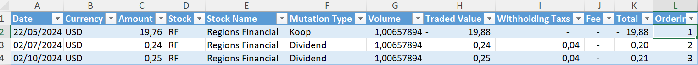

# Ingestion of ***Transactions of Trade Account*** (Azure Blob Storage - Excel) [Back to readme](../../../README.md#tutorials-ingestions)

This tutorial will help you design an `ingestion`-dataset which will full load `transactions` from  [Azure Storage Account](https://learn.microsoft.com/en-us/azure/storage/common/storage-account-overview), thge data will come from a ` blob`-container and has `transaction` information storeed in excel fromat. The turorial will be making use of the following languages, Technologies and Tooling. Assumtions are made that the reader is familair and has some experience with the below mentioned *Languages*, *Technologies* and *Tooling*. Next to this, the tutorial will assume you have access to `Azure Blob Container` via the `Accesskey` (Security wish this accesskey should be rotate on a perioding basis).

**Languages:**


**Technologies:**


**Tooling:**


***Table of Content***

- [Ingestion of **Currency Exchange Rates** (webtable from Yahoo) Back to readme](#ingestion-of-currency-exchange-rates-webtable-from-yahoo-back-to-readme)
  - [User Story](#user-story)
    - [Additionals Infomation](#additionals-infomation)
  - [Exploration of the dataset structure (back to top)](#exploration-of-the-dataset-structure-back-to-top)
    - [goto website](#goto-website)
    - [Mapping](#mapping)
    - [Lets do the mapping](#lets-do-the-mapping)
  - [Deployemnt](#deployemnt)
  - [Run and Validate](#run-and-validate)
  - [Implementing EUR x CAD](#implementing-eur-x-cad)
  - [All Done](#all-done)

---

## Preparation

In the `4-Transactions-of-Trade-Account`-folder the example `Excel`-file is stored named `transactions.xlsx`, perform the following steps

1. On the `Container` create a folder named `transactions`
2. Store the [`Excel`-file](4-Transactions-of-Trade-Account/transactions.xlsx) in this folder on the `Blob`-container folder.
3. make sure yu have the accesskey avialable.
3. Validate if you stored the accesskey in the secrets-database, secret-name should be `Yahoo-Blob-SAS-Token'. With the python code below you can ensure it is there.

````python
# Add the directory containing the file to sys.path
import getpass
import sys
fp_git_folder = 'path/to/git/folder'
nm_your_repo  = 'name-of-model'
fp_modules    = f"{fp_git_folder}/{nm_your_repo}/4-processing-python/modules"
sys.path.insert(0, fp_modules) 

# Import the module
from secrets import add_secret

# Retrive the information by prompting the user
ds_secrets = getpass.getpass(f"Secret : ") # enter secret

# Setting my-documentation-... secrets.
add_secret("Yahoo-Blob-SAS-Token", nm_container)
````

## User Story

As an **analyst**, I want to access the **transactions** that were made with the `trade account`, So that I can calculate **trading performance metrics** such as **losses, gains, and yield (rendement)** all in **EURO** currency. This information is stored on `Azure Blob Container`. The  account is named `demoasawedev`, the container is named `yahoo` with a `transactions`-folder and file `transactions.xlsx`.


### Implentation

As in the previous tutorial of [Stock Trading Information](1-Stock-Trade-Information.md) and others we\`ll start with a Exploration of the dataset structure, do the mapping in the `meta-data-editor` and Deploy the new dataset, Run the data pipeline and validate. Since this is a webtable as wll, we can follow the same steps. 

## Exploration of the dataset structure ([back to top](#ingestion-of-list-of-currencies-webtable-from-wikipedia-back-to-readme))

Before we start designing the dataset, we must understand what the structure of the dataset is. For this purpose we\`ll be reusing various existing python procedures. As before in tutorial of [Stock-Trade-Information](1-Stock-Trade-Information.md) We\`ll perform the same steps, only we\`ll not explian in the same level of detail. Remember, with webpages, what you see, is not always what you get. The python data pipeline is basically a web-scrapper and the `table` we want to extract maybe presentated differently on the webpage and is in html. So the first step is to fetch the dataset manually.

### goto blob container

we must determine the structure of the file, here for we must locate the file on the blob container and which azure storage aacount is used, container and possible folder(s) the file is stored (*For this demo you should have you own storage account, see preparation of the required information*). 

When the file is located it can be downloaded and explored, see image below for a impression of the content.



While exploring the file, we see the name of the sheet is `Transactions`, there is also column named `Date`, `Stock` and `Mutation Type`, there three are good condidates for `Businesskeys`. We have now the required information to start mapping.

### Mapping

The `meta-data-editor` has parameter-groups : (tab) Setting-table ->  (subtab) Parameter group, we need `abs_sas_url_xls`, this one has 9 paramters that require a value.

| Parameter | Value | Comment |
|:---       |:---   |:---     |
| abs_1_xls_nm_account           | demoasawedev         | |
| abs_2_xls_nm_secret            | Yahoo-Blob-SAS-Token | |
| abs_3_xls_nm_container         | yahoo                | |
| abs_1_xls_nm_account           | demoasawedev         | |
| abs_4_xls_ds_folderpath        | \yahoo\transkaction\ | |
| abs_5_xls_ds_filename          | transactions.xlsx    | |
| abs_6_xls_nm_sheet             | Transactions         | |
| abs_7_xls_is_first_header      | 1                    | 1 = true and 0 = false
| abs_8_xls_cd_top_left_cell     |                      | can be left empty, if there is a specific range then provide. |
| abs_9_xls_cd_bottom_right_cell |                      | can be left empty, if there is a specific range then provide. |

The python procedure that extract the web-table is found `<your-git-folder>\<name-of-your-model>\4-processing-python\modules\`-folder and the `source.py`-file. The procedure is named `abs_sas_url_xls` and hase 9 input parameters, see list above.

### Lets do the mapping

python: ***[example](./4-Transactions-of-Trade-Account/Explore-Excel-from-Blob.py) Explore Excel***
````python

# Add the directory containing the file to sys.path
import sys
# if you don't want type in the folder/file path on runtime.
fp_git_folder = "path-to-your-git-folder"
nm_your_repo  = "name-of-your-repository"

# Set the path to the modules directory
fp_modules    = f"{fp_git_folder}/{nm_your_repo}/4-processing-python"
sys.path.insert(0, fp_modules) 

# Import Modules
from modules import source as src  # type: ignore

# Extract web table
df = src.abs_sas_url_xls (
    # Input Parameters
    abs_1_xls_nm_account           = "demoasawedev",
    abs_2_xls_nm_secret            = "Yahoo-Blob-SAS-Token",
    abs_3_xls_nm_container         = "yahoo",
    abs_4_xls_ds_folderpath        = "transactions",
    abs_5_xls_ds_filename          = "transactions.xlsx",
    abs_6_xls_nm_sheet             = "Transactions",
    abs_7_xls_is_first_header      = "1",
    abs_8_xls_cd_top_left_cell     = "",
    abs_9_xls_cd_bottom_right_cell = "",
    is_debugging                   = "1"
)

````

***Results***
````
Column Name:
------------------------------------
Date
Currency
Amount
Stock
Stock_Name
Mutation_Type
Volume
Traded_Value
Withholding_Taxs
Fee
Total
Ordering
------------------------------------

# Columns : 12
# Records : 12

------------------------------------
````

In the previous tutorials we did load/ingested webtable, this is Excel file from Blob Container on the Azure Platform. So starting with `new` dataset would be the best option, in case we\`ll be loading more excel files form Blob Storages we can re-use this dataset as a template.

So let`s open the ` meta-data-editor` if not already open and open a new `dataset`.

> Main Menu -> Dataset -> Dataset -> New-button. 

> ***Best Practis*** : A new source, a new **Group**

### Adding new ***Group***

A new ***Group*** would be best, since this information comes from a different source being `Demo Blob Container`. Let open the list of ***Groups*** and add one named `PSA-003-Transaction`, for description `Transactions` will do, feel free to make it more suittable for your own needs. After You are done go back to the `detail`-form for `Dataset`, you may need th use the `F5`-button to refesch the list of ***Groups***.


### Change Dataset Information

| Attribute          | Set to Value |
|:---                |:---       |
| Name               | `Trade Account Transactions` |
| Schema             | `psa_trade_account` |
| Table              | `transaction` |

### Change Attribute Information

| #   | BK | Column Name      | Datatype      | Nullable | Attribute (Name)     | Attribute (Description) |
|:--- |:---|:---              |:---           |:---      |:---                  |:---                     |
| 1   |  V | Date             | NVARCHAR(999) | V        | Datetime Transaction | Datetime of Transaction |
| 2   |    | Currency         | NVARCHAR(999) | V        | Currency             | ISO Currency of Transaction |
| 3   |    | Amount           | NVARCHAR(999) | V        | Amount               | Price per Stock/Share, this also can be the amount of dividence paid out. |
| 4   |  V | Stock            | NVARCHAR(999) | V        | Stock Code           | Code of the Stock on the trading platform |
| 5   |    | Stock_Name       | NVARCHAR(999) | V        | Stock Name           | Stock Name |
| 6   |  V | Mutation_Type    | NVARCHAR(999) | V        | Mutation Type        | Mutation Types (Koop, Verkoop, Divident) |
| 7   |    | Volume           | NVARCHAR(999) | V        | Volume               | # Number of Stock involved |
| 8   |    | Traded_Value     | NVARCHAR(999) | V        | Traded Value         | Trade Value (before Fee and/or Taxes) |
| 9   |    | Withholding_Taxs | NVARCHAR(999) | V        | Withholding Taxs     | Taxes that were Witheld  |
| 10  |    | Fee              | NVARCHAR(999) | V        | Fee                  | Fee for the Trading platform |
| 11  |    | Total            | NVARCHAR(999) | V        | Total                | Mutation Amount of the transaction, this is what will be subtracted of subplemented to the Trade Accoutn Balance |
| 12  |    | Ordering         | NVARCHAR(999) | V        | # Ordering           | # Original Order of the Mutations |

### Change Parameter Information

| Parameter | Value |
|:--- |:--- |
| abs_1_xls_nm_account            | `demoasawedev` |
| abs_2_xls_nm_secret             | `Yahoo-Blob-SAS-Token` |
| abs_3_xls_nm_container          | `yahoo` |
| abs_4_xls_ds_folderpath         | `transactions` |
| abs_5_xls_ds_filename           | `transactions.xlsx` |
| abs_6_xls_nm_sheet              | `Transactions` |
| abs_7_xls_is_first_header       | `1` |
| abs_8_xls_cd_top_left_cell      | |
| abs_9_xls_cd_bottom_right_cell  | |

### SQL for Metadata-Attributes

| Attribute                    | Value |
|:---                          |:--- |
| Processing Type              | `Fullload` |
| SQL for `meta_dt_valid_from` | `tsl.[Date]` |
| SQL for `meta_dt_valid_till` | `'9999-12-31'` | 

### Source Query

After `Saving` the metadata defintions for `Trade Account Transactions` we can "add" the `source query` by using the `create source query from attribute`-button. 

## Deployment

We can Save the definitions to the repository and `Deploy` to the `Development` by clicking `Deploy to Development`-button.

## Run and Validate

After deployment of the dataset, a data pipeline can be run by reusing the [`python`-script](./1-Stock-Trade-Information/2-Test-and-Validate.py) from the tutorial [Stock Trade Infromation](1-Stock-Trade-Information.md) and adjusitng it for the `schema` and `table` names used.

After running the script the result should give a dataset that would look something like

|    | Date                | Currency   |   Amount | Stock   | Stock_Name        | Mutation_Type   |   Volume |   Traded_Value |   Withholding_Taxs |   Fee |   Total |   Ordering |
|---:|:--------------------|:-----------|---------:|:--------|:------------------|:----------------|---------:|---------------:|-------------------:|------:|--------:|-----------:|
|  0 | May 22 2024 12:00AM | USD        |    19.76 | RF      | Regions Financial | Koop            |  1.00658 |         -19.88 |               0    |  0    |  -19.88 |          1 |
|  1 | Jul  2 2024 12:00AM | USD        |     0.24 | RF      | Regions Financial | Dividend        |  1.00658 |           0.24 |               0.04 |  0    |    0.2  |          2 |
|  2 | Oct  2 2024 12:00AM | USD        |     0.25 | RF      | Regions Financial | Dividend        |  1.00658 |           0.25 |               0.04 |  0    |    0.21 |          3 |
|  3 | Jan  3 2025 12:00AM | USD        |     0.25 | RF      | Regions Financial | Dividend        |  1.00658 |           0.25 |               0.04 |  0    |    0.21 |          4 |
|  4 | Mar 11 2025 12:00AM | USD        |    20.07 | RF      | Regions Financial | Verkoop         |  1.00658 |          20.2  |               0    |  1.11 |   19.09 |          5 |

## All Done

With the help of the `copy`-feature in the `meta-data-editor` adding new `Ingestion`-dataset to het `model` is relatively easy. You could even choice to add `Template`-dataset for every type of source that would be used, copy from there.
