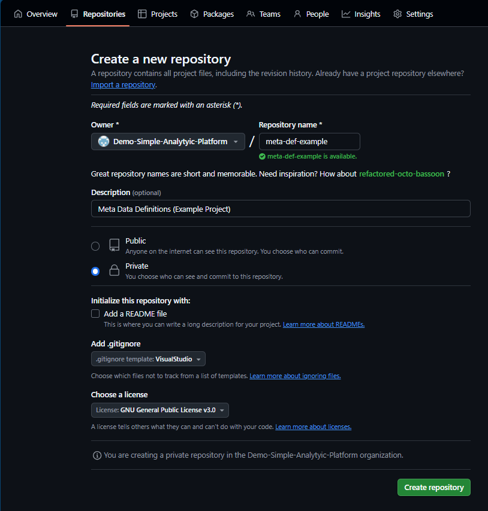
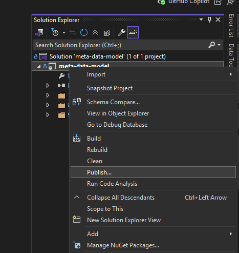
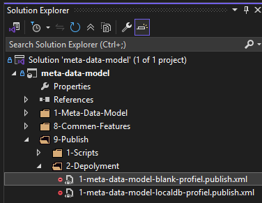

# meta-data-model

This SQL Server Solution/Project will form the core of "***Meta-Data-Model***" for the deployment and processing logic. It works in Conjunction with "***Meta-Data-Def***"-repository which should hold the meta-data-definitions for model (project). This repository only holds "***Meta-Data-Model***".<br>
The repository for the "***Meta-Data-Def***" can be found [here on git hub](https://github.com/Demo-Simple-Analytyic-Platform/meta-data-def).

## How to get Started


To start using the framework the following step must be under taken.

### 1. Meta-Data-Model

To use this repository, new repositories must be created under you own control, surely for the model part. The `meta-data-model`-part can be used as is. But you won't have control over it, better to make you own copy perhabs. The `meta-data-model`-part has all the database schemas, table, view, functions and procedures for `Deployment`- and internal data `Processing`- logic.
To keep `Models` lean and easy deployable, it would be good practic to bundel related `datasets` per `model` the framework allows for referencing other `Models` and reusing the `datasets`.

> ***Note:*** If you are content with the workings of the framework as is and have no intentions on modifying it, steps 3, 4, 5 and 6 can be skipped. The solution can be deployed from the *Visual Studio*-solution named "***meta-data-model.sln***" in the `\git\template\meta-data-model\`-folder after you have cloned it there.

1. Create a local folder on the root, name it `git` with a subfolder named `template`. This where you'll be storing/cloning the local versions of repositories.
2. Clone this [repo](https://github.com/mehmetmisset/linkedin-article-1-data-ingestion-transformation-requirements.git) to the `\git\template\`-folder. remember, this repo is publicly accessiable and `readonly` for all but the `owners`.
3. Create new git repository named `meta-data-model`, which under the `your` own control. pre-populate the git inore file with "*Visual Studio*"-stuff. If forgotten, not to worry, just copy-paste then `.gitinore`-file from the `template`.
On github it should look something like this:

*Image: screenshot from github.com*
4. Clone `your` repo to `\git\`-folder, to make if locally aviable.
5. Copy the content including subfolder and all files of folder `\git\template\meta-data-model` to `\git\meta-data-model`-folder, `.vs`-folder can be ignored if avialable.
````cmd
xcopy "C:\git\template\meta-data-model" "\git\meta-data-model" /E /I /H /C /Y
````
6. Open the *Visual Studio*-solution named "***meta-data-model.sln***" from the `\git\meta-data-model\`-folder.
7. Commit the changes to the branch and push to the remote.<br>
It up to you as a developer to create "*initizaltion*"-branch or something like it or just update the "*main*"-branch directly.
8. Now you can "*publish*" the `Project` named `meta-data-model` to your target database. (If you are not provisiant in visual studio, educate you self first)


*Image: Screen of dropdown menu with publish highlighted*

After the **build** completes successfull, the dialoog window below appears, provide the targat database credentials, if desirable *save* the profile.
Folderpath to presaved Publish-profiles


*Image: Publish Database dialog*

An example of a saved profile can be found in the folder `/9-Publish/2-Deployment/`.


*Image: Folderpath to presaved Publish-profiles*

The deployment- processing- logic has now be installed.

### 2. Meta-Data-Definition for a Model

Per `Model` a repository should be created, unlike the `meta-data-model`, these must be under you own control, for here the `meta-data-definitions` will be stored. The following steps should be taken to start utilizing the framework, we'll assume you have already executed steps 1 till up on 7 for the [1. Meta-Data-Model](#1-meta-data-model).

1. Create new git repository and give it the name of your `Model`,  make sure the name of the repo has a maximum of 16 characters. So short, compact and functional will do the trick.
2. Clone this new repository to your local `\git\`-folder, make sure the folder-name is equal to the name of the repository.
3. Copy the files and folders (including subfolder and files) from `\git\template\meta-data-definitions\`-folder.
4. Open the *Visual Studio*-solution named "***meta-data-definitions.sln***" from the `\git\<name-of-your-model>\`-folder.
5. Rename the *Visual Studio*-solution to the name of your model. With one `Model` this may seems for zelles, but more `Models` may be needed and keeping them apart woudl be tricky if they all have the same "*solution*"-name.
6. Navigate to `\git\<name-of-your-model>\2-meta-data-definitions\1-Frontend\`-folder and open the Microsoft Access File to start the `Frontend`-application. The application will try to determine the path to the repository, this will only work in the repository name is no longer the 16 characatere, otherwise the application wil give an error prompting you to shorten the name.
7. Navigate to the `Settings`-tab and click on import and the on export, this will ensure all the meta-data-defintion sql-files are in place.
8. Commit the changes to the branch and push to the remote.
9. Now you can "*publish*" the `Model` to your target database.

The deployment of your data solution should be done in few seconds, depending on the connection and speed/power of hte target database. The deployment time will increase when more and more dataset are added to the `Model`.

> ***Note:*** Different `Models` can be deployed to the same target database. `Datasets` referenced from another `Model` which are deployed to the same dataset are NOT deployed double. If the referenced `Dataset` is deployed to a different target database, it will be treaded as if it were a "*Ingestion*"-dataset, the required paramateres will be extracted form de `Model`-information.


