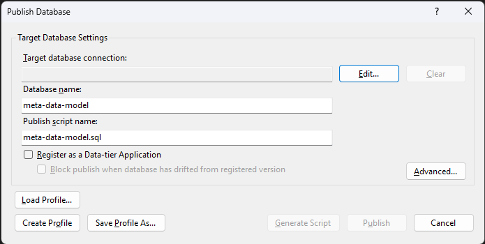
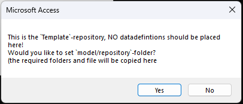
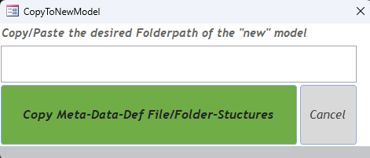
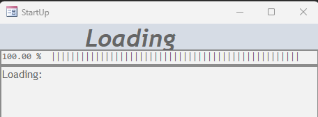
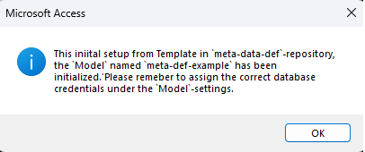

# meta-data-model

This SQL Server Solution/Project will form the core of "***Meta-Data-Model***" for the deployment and processing logic. It works in Conjunction with "***Meta-Data-Def***"-repository which should hold the meta-data-definitions for model (project). This repository only holds "***Meta-Data-Model***". 
The repository for the "***Meta-Data-Def***" can be found [here on git hub](https://github.com/Demo-Simple-Analytyic-Platform/meta-data-def).

## How to get Started

### Before starting

The below will assume you as a developer (Data Engineer) has experiance with

- Git (The step below will referecen github, but any other will do, if you have experiance with git you'll already know this)
- Visual Studio (big brother of Visual Studio Code)
- Visual Studio Code
- Microsoft SQL Server / Database
- Microsoft Office Access
- SQL (T-SQL, the transfromation queries need to be in T-SQL)
- Python (reading, executing and writting to some extrent)

### Meta-Data-Model (MDM)

To use this repository, new repositories must be created under you own control, surely for the model part. The `meta-data-model`-part can be used as is, however you will nog be in control of updates, better to make you own copy perhabs. The `meta-data-model`-part has all the database schemas, table, view, functions and procedures for `Deployment`- and internal data `Processing`- logic.

> ***Tip:*** To keep `Models` lean and easy deployable, it would be good practic to bundel related `datasets` per `model` the framework allows for referencing other `Models` and reusing the `datasets`.

> ***Note:*** If you are content with the workings of the framework as is and have no intentions on modifying it, steps 3, 4, 5 and 6 can be skipped. The solution can be deployed from the *Visual Studio*-solution named "***meta-data-model.sln***" in the `\git\template\meta-data-model\`-folder after you have cloned it there.

#### To start using the framework the following step must be under taken

1. Create a local folder on the root, name it `git` with a subfolder named `template`. This where you'll be storing/cloning the local versions of repositories.

2. Clone this [repo](https://github.com/Demo-Simple-Analytyic-Platform/meta-data-model.git) to the `\git\template\`-folder. remember, this repo is publicly accessiable and `readonly` for all but the `owners`.

3. Create new git repository named `meta-data-model`, which under the `your` own control. pre-populate the git inore file with "*Visual Studio*"-stuff. If forgotten, not to worry, just copy-paste then `.gitinore`-file from the `template`.
On github it should look something like this:   *Image: screenshot from github.com*
4. Clone `your` repo to `\git\`-folder, to make if locally aviable.
5. Copy the content including subfolder and all files of folder `\git\template\meta-data-model` to `\git\meta-data-model`-folder, `.vs`-folder can be ignored if avialable.
6. Open the *Visual Studio*-solution named "***meta-data-model.sln***" from the `\git\meta-data-model\`-folder.
7. Commit the changes to the branch and push to the remote. 
It up to you as a developer to create "*initizaltion*"-branch or something like it or just update the "*main*"-branch directly.
8. Now you can "*publish*" the `Project` named `meta-data-model` to your target database. (If you are not provisiant in visual studio, educate you self first)   *Image: Screen of dropdown menu with publish highlighted*

After the **build** completes successfull, the dialoog window below appears, provide the targat database credentials, if desirable *save* the profile.
Folderpath to presaved Publish-profiles.  *Image: Publish Database dialog*

An example of a saved profile can be found in the folder `/9-Publish/2-Deployment/`.   *Image: Folderpath to presaved Publish-profiles*

The deployment- processing- logic has now be installed.

### Meta-Data-Definition (MDD) for a Model

As the [meta-data-model (MDM)](#meta-data-model-mdm) contains the database logic for deployment and processing datasets, The ["***Meta-Data-Definition (MDD)***"-repository](https://github.com/Demo-Simple-Analytyic-Platform/meta-data-def) holds the definitions templates for the metadata of these "***Datasets***".

For the *maintainability* it would be good pratic to limit then "***Model***"-size in the scope and number of "***Datastes***". For this purpose one repository per model should be created under the control of you as a developer.

#### To start using the framework the following step must be under taken.

1. Create new git repository and give it the name of your `Model`, make sure the name of the repo has a maximum of 16 characters. So short, compact and functional will do the trick.
2. Clone this new repository to your local `\git\`-folder, make sure the folder-name is equal to the name of the repository.
3. Clone the "template"-repository of "meta-data-def" to the `\git\template\meta-data-def\`-folder.
4. navigate to the `\git\template\meta-data-def\2-meta-data-definitions\1-Frontend\`-folder and start the `Microsoft Office Access`-application named `ms-access-frontend`. The "StartUp"-form is loaded and the first message will appear that will give you the option to copy/paste the required file/folder structures to the *new* `model`.  *image: Would you like to set model/repostitory-folder?*
5. If `No` is chosen, the application will shuts down. However if you as a developer are lazy, you'll have chosen `Yes` a new form will load, see below.   *image: Set new model folder*
6. There you'll have another change to back out, by clicking on `Cancel`. But after copy-pasting the *new* `model`-folder into the input text-field, you can click on `Copy Meta-Data-Def File/Folder-Structure`. If all goes well the application will start in the *new* `model`-folder location.  *image : Start-Up form* If the `\git\`-folder with the subfolders was not declared `save` you'll need to close the form first and accept the warning or set the `\git\`-folder as save.  *image : security waring for `active`-content*
7. A new message dialogbox will appear informing the this instance is the `running` in `initial setup`.  *Image : Initial Setup* This will only appear directly after copy/past action from the `meta-data-def`-repository.
8. Navigate to the `Model`-tab and expand the `Model`-record to provide the database credentials for the various environments. (The `Secret` is **NOT** the **Password** for the provide *Username*, it should be the name of the ***Secret*** where the **Pasword** is stored.)
9. Open the *Visual Studio*-solution named "***meta-data-definitions.sln***" from the `\git\<name-of-your-model>\`-folder. Rename the *Visual Studio*-solution to the name of your model. (*With one `Model` this may seems over zellis, but with more `Models` with the same "Name" will make if very quickly, easy to get lost in the "Models" and "Solutions" with the same name*).
10. After the rename, do a `Build`, if succesfull you can commit the changes to the repository-remote (comment: "Intital setup" of something simular).
11. Now you can "*publish*" the `Model` to your target database.
12. Commit the changes to the branch and push to the remote.

The deployment of your data solution should be done in few seconds, depending on the connection and speed/power of hte target database. The deployment time will increase when more and more dataset are added to the `Model`.

> ***Note:*** Different `Models` can be deployed to the same target database. `Datasets` referenced from another `Model` which are deployed to the same dataset are NOT deployed double. If the referenced `Dataset` is deployed to a different target database, it will be treaded as if it were a "*Ingestion*"-dataset, the required paramateres will be extracted form de `Model`-information.

> ***Note:*** The `meta-data-def`-project also contains a solution for `Secrets`-database, by deploying this database secrets can be stored in `relative` safety, acccess to this database should be very limited.
>> **Disclamer:** with a large scale (cloud) solution Azure Key Vault or simular should be implemented!

